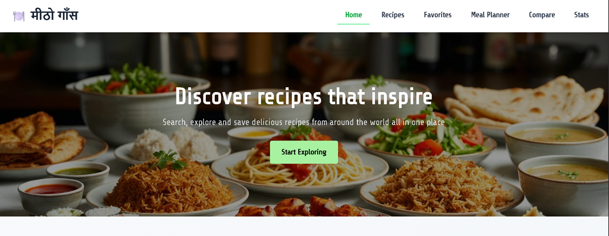
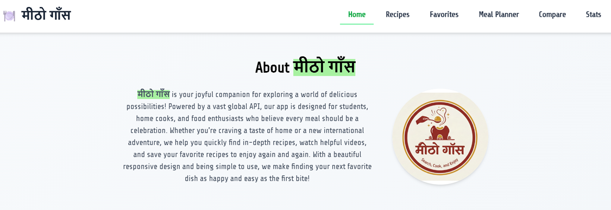
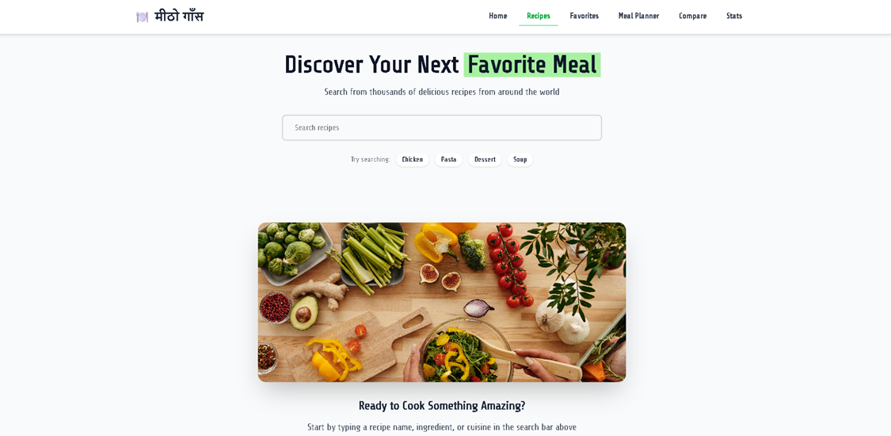
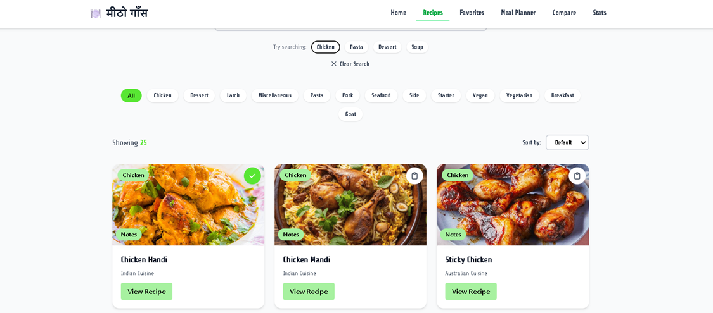
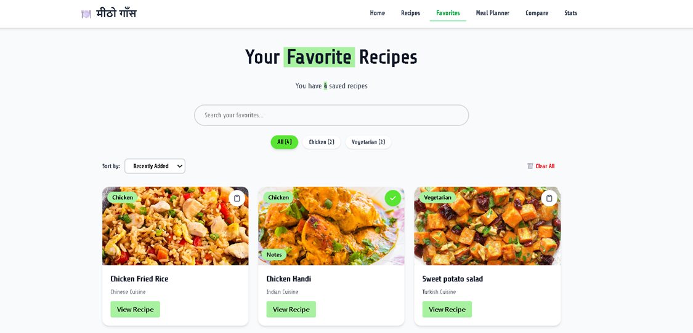
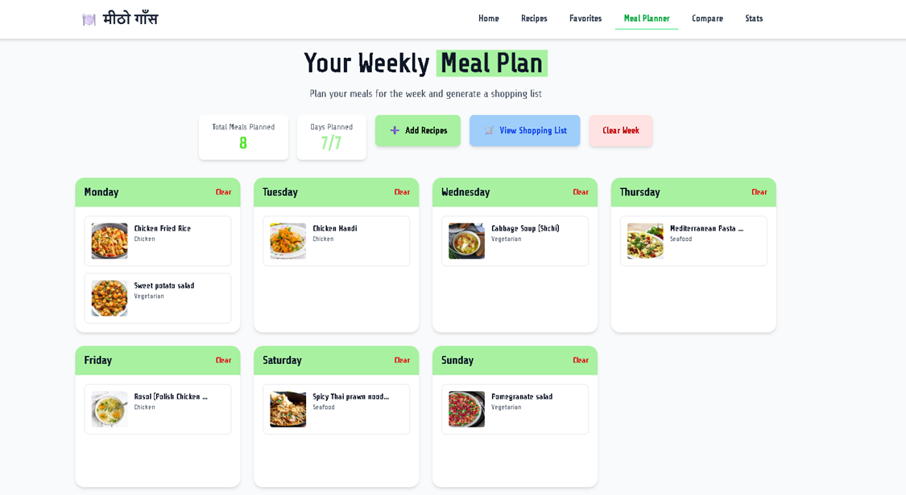
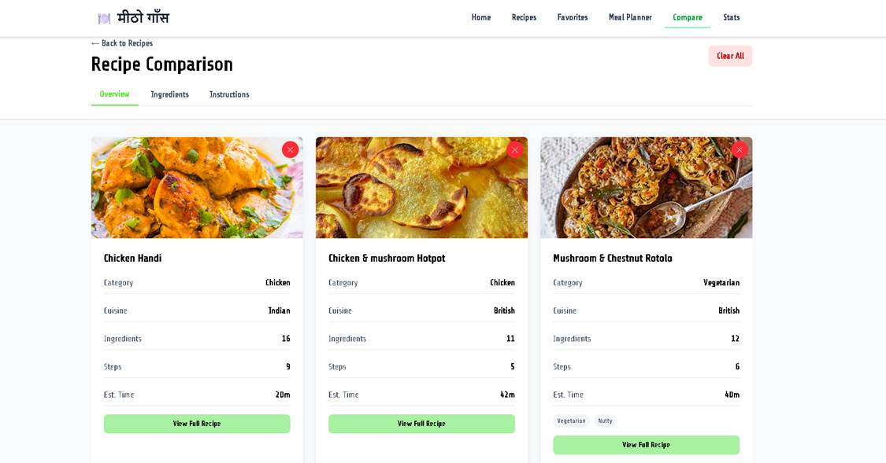

मीठो गाँस (Mithogaas) - Recipe Finder App
Your joyful companion for exploring a world of delicious possibilities!

________________________________________
Screenshots
•	HomePage
 
 
    
•	SearchRecipePage

•	FavoritePage

 
•	MeanPlannerPage

•	RecipeComparisonPage

Features
 Smart Recipe Search
•	Real-time search with debouncing
•	Filter by categories and cuisines
•	Alphabetical sorting (A-Z, Z-A)
•	Beautiful loading skeletons

Favorites System
•	Save your favorite recipes
•	Quick access to saved recipes
•	Persistent storage across sessions

Meal Planning
•	Weekly meal planner with calendar view
•	Drag-free recipe assignment to days
•	Auto-generated shopping lists
•	PDF export for meal plans

Smart Shopping Lists
•	Automatic ingredient aggregation
•	Print-friendly format
•	CSV export option
•	Copy to clipboard

Recipe Comparison
•	Compare up to 3 recipes side-by-side
•	Highlight common ingredients
•	Side-by-side instructions

Recipe Notes & Customization
•	Personal notes for each recipe
•	Ingredient substitution tracking
•	Cooking session logs
•	Star ratings (1-5)
•	Personal cooking tips

Stats Dashboard
•	Track recipes viewed, favorites, and cooked
•	Visual charts and graphs
•	Activity heatmap
•	Success rate tracking
•	Most viewed recipes

User Experience
•	Fully responsive design (mobile, tablet, desktop)
•	Smooth animations and transitions
•	Loading skeletons for better UX
•	Clean, modern interface

________________________________________
Quick Start
Prerequisites
•	Node.js (v14 or higher)
•	npm or yarn
•	Modern web browser

Installation
1.	Clone the repository
2.	git clone https://github.com/yourusername/mithogaas.git
3.	cd mithogaas
4.	Install dependencies
5.	npm install
6.	Start the development server
7.	npm run dev
8.	Open your browser
9.	Navigate to http://localhost
________________________________________
Tech Stack
Frontend
•	React 18.x - UI library
•	React Router - Navigation and routing
•	Tailwind CSS - Styling and design
•	Vite - Build tool and dev server

APIs
•	TheMealDB API - Recipe data source

Storage
•	localStorage - Client-side data persistence

State Management
•	React Context API - Global state management
•	React Hooks - Component state

________________________________________

Project Structure
mithogaas/
├── public/
├── src/
│   ├── assets/
│   │   └── Images/
│   ├── Components/
│   │   ├── ComparisonBar.jsx
│   │   ├── RecipeCard.jsx
│   │   ├── RecipeNotesSection.jsx
│   │   ├── SearchBar.jsx
│   │   └── Skeletons.jsx
│   ├── Hooks/
│   │   ├── useComparison.jsx
│   │   ├── useFavorites.jsx
│   │   ├── useMealPlanner.jsx
│   │   ├── useRecipeNotes.jsx
│   │   └── useStats.jsx
│   ├── Pages/
│   │   ├── Favorites.jsx
│   │   ├── HomePage.jsx
│   │   ├── MealPlanner.jsx
│   │   ├── RecipeComparison.jsx
│   │   ├── RecipeDetail.jsx
│   │   ├── Recipes.jsx
│   │   └── StatsDashboard.jsx
│   ├── Utils/
│   │   └── PDFGenerator.jsx
│   ├── App.jsx
│   └── main.jsx
├── index.html
├── package.json
└── vite.config.js
________________________________________
Responsive Breakpoints
Mobile:    < 640px
Tablet:    640px - 1024px
Desktop:   > 1024px
________________________________________
Key Features Explained
Meal Planning
•	Plan your entire week in advance
•	Automatically generates a combined shopping list
•	Export and print your meal plan
•	Clear individual days or the entire week

Recipe Comparison
•	Select up to 3 recipes to compare
•	View differences in ingredients, steps, and cooking time
•	Identify common ingredients across recipes
•	Make informed decisions on which recipe to try

Personal Notes
•	Add custom notes to any recipe
•	Track ingredient substitutions (e.g., "butter → oil")
•	Log cooking attempts with success/fail status
•	Rate recipes with a 5-star system
•	Save personal cooking tips

Statistics Dashboard
•	Visualize your cooking journey
•	Track viewing habits and favorites
•	Monitor cooking success rates
•	See activity patterns over time
________________________________________
Author
Your Name
•	GitHub: @yourusername
•	LinkedIn: Your Name
________________________________________
Acknowledgments
•	Recipe data provided by TheMealDB API
•	Icons and illustrations from various free sources
•	Inspired by modern recipe apps and cooking enthusiasts
________________________________________
Support
If you found this project helpful, please give it a ⭐!
For questions or feedback:
     Reach out on LinkedIn
________________________________________
